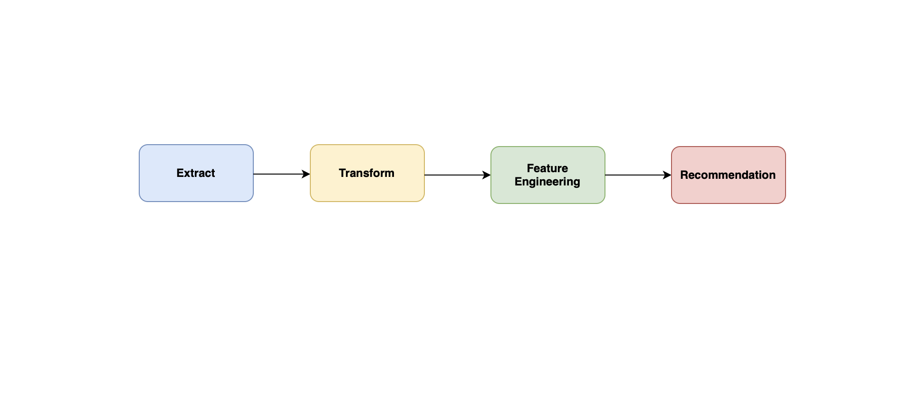

# Movie_Recommendation_Project

# Dataset

This project uses the `movies_metadata.csv` dataset from Kaggle:
[Link to dataset](https://www.kaggle.com/rounakbanik/the-movies-dataset)

# Movie Recommendation Pipeline

A content-based movie recommendation system built with Python, Pandas, and Scikit-learn. This project demonstrates a simple ETL pipeline and feature-based recommendation engine using TF-IDF and cosine similarity.

## Pipeline Overview

Here’s a visual of the ETL and recommendation pipeline:

---

## Features

- **Clean & Prep the Data**  
  Handle missing values, parse genres, and combine movie overview + genres into a single feature.

- **Feature Engineering**  
  Turn movie descriptions into TF-IDF vectors so the system can “understand” text.

- **Movie Recommendations**  
  Find the most similar movies using cosine similarity and show key info like:
  `title`, `original_title`, `budget`, `revenue`, `runtime`, `vote_average`, `release_date`, and `production_countries`.

